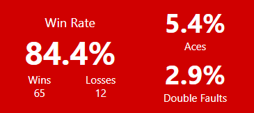
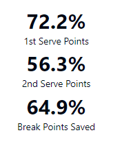
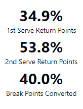
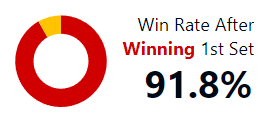
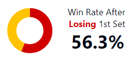
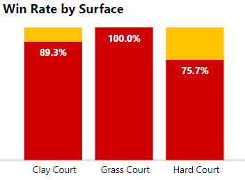
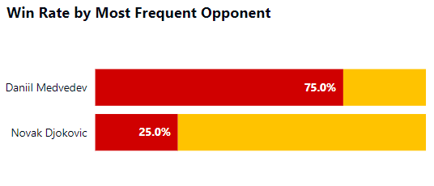
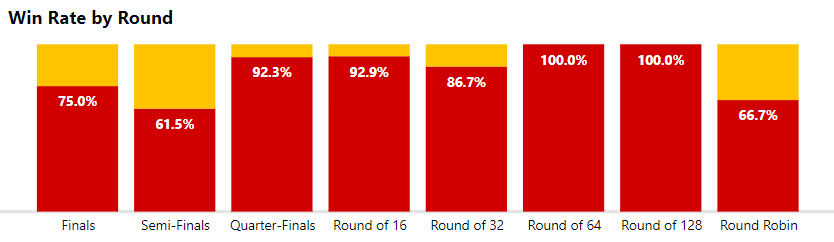
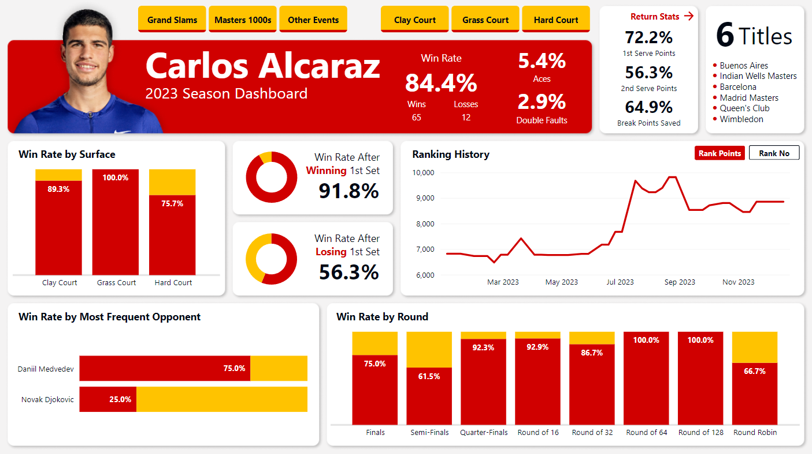

# Analysis of Carlos Alcaraz 2023 Season

## Table of Contents

- [Introduction](#introduction)
- [Objective](#objective)
- [Data source](#data-source)
- [Methods](#methods)
- [Tools](#tools)
- [Analysis results](#analysis-results)
- [What can be improved](#what-can-be-improved)
- [Dashboard](#dashboard)

## Introduction

Despite his young age, Carlos Alcaraz is undoubtedly one of the greatest tennis players at the moment, not for nothing he finished the year in second place in the world ranking, demonstrating his great ability and maturity, so as a tennis player and a fan of him and his playstyle I wanted to develop my data analysis skills and knowledge building this project.

## Objective

Analyze Carlos Alcaraz's performance on the 2023 Tennis Tour by creating an interactive dashboard to answer the following key questions:

- How was his overall performance during the season?
- How does winning or losing the first set affect the outcome of the match?
- On which surface did he perform better?
- Who did he face the most?
- How did he perform in each round?

## Data source

The "atp_matches_2023" dataset was taken from [Jeff Sackmann's GitHub profile](https://github.com/JeffSackmann), thanks to him for his incredible work in compiling tennis matches statistics over the years.

The "alcaraz_rank_history" dataset was created using data from the [ATP Tour website](https://www.atptour.com/en/players/carlos-alcaraz/a0e2/rankings-history) and [Ultimate Tennis Statistics](https://www.ultimatetennisstatistics.com/playerProfile?playerId=52602&tab=ranking#).

The datasets can be found [here](https://github.com/AlexVegaR/Analysis-of-Carlos-Alcaraz-2023-Season/tree/main/datasets).

## Methods

- Data gathering
- Data wrangling
- Exploratory data analysis
- Data visualization

## Tools

- **Power BI**: Power Query, DAX

## Analysis results

Carlos Alcaraz finished the season with 6 titles, including 1 Grand Slam and 2 Masters 1000s, and an overall winning percentage of 84.4%, which ranked him second in the world.

He had an ace rate of 5.4%, a stat that does not stand out among his tennis counterparts, and a double fault rate of 2.9%, very close to the average rate of the top 10 players.

A comparison of his service and return statistics shows that he is significantly better in games where he is the server.

Winning the first set indicates that he is very likely to win the match, as he had a 91.8% winning percentage after winning the first set, with 56 wins and 5 losses.

Losing the first set is something that did not happen too often, only 20.8% of the matches, and it was not an indicator of a lost match, as he had a winning percentage of 56.3% after losing the first set, where he won 9 matches and lost 7.

He had a clearly better performance playing on grass than on any other surface, winning the 12 matches he played and obtaining 2 titles, Wimbledon being one of them. 

Playing on clay, he obtained 3 titles, the most for him on a specific surface, winning 25 matches and losing 3. 

Playing on hard court, he had a winning percentage of 75.7%, his worst performance of the 3 surfaces, winning 25 matches and losing 9, but still winning 1 title.

The opponents he faced the most this season were Daniil Medvedev and Novak Djokovic, each with 4 matches. He had a better performance against Medvedev with a winning percentage of 75%, while he suffered more against Djokovic with a winning percentage of 25%.

His best performance was in the round of 64, where he won the 8 matches he played, and in the round of 128, where he won the 3 matches he played.

His worst performance was in the Semi-Finals, where he won 8 matches and lost 5.

In Finals, he achieved a winning percentage of 75%, winning 6 of the 8 matches he played.

## What can be improved

- Include previous year's statistics to compare his performance and see how his game has changed over time.
- Compare his statistics to the overall average to see if he is under or over it.
- The dashboard has too many visuals and data, so it can be overwhelming for some people to clearly understand and compare all the information. It could be divided into different pages, each with a different category of data.

## Dashboard

The online Power BI dashboard can be found [here](https://app.powerbi.com/view?r=eyJrIjoiOTc3ZjA5NDgtZWE1NS00ZGIwLTllMmUtNDRiMjc1ZTE2MTFkIiwidCI6IjI2NjZiNGUyLWU2MjctNDA2OS05YzkwLWJkNTUxNDQyMjQ0NyIsImMiOjR9).

The Power Query M code used to cleanse and prepare the data can be found [here](https://github.com/AlexVegaR/Analysis-of-Carlos-Alcaraz-2023-Season/tree/main/power_query_m_code).

